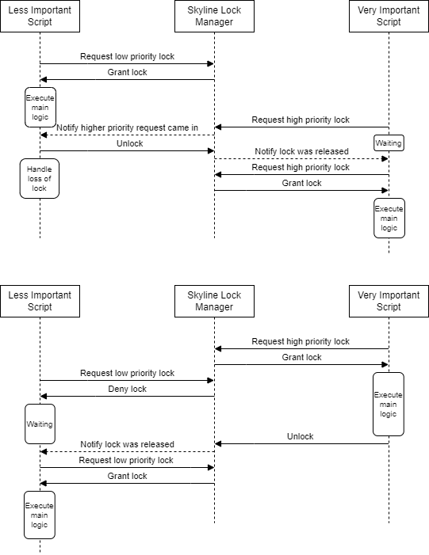

# Skyline Lock Manager

## About

The Skyline Lock Manager connector allows the management of locks within a DataMiner System for any kind of object by providing a centralized manager accessible through a public API.

### System Info

| Range | DCF Integration | Cassandra Compliant | Linked Components |
|--|--|--|--|
| 1.0.0.x | No | Yes | [Skyline Lock Manager ConnectorAPI Nuget](https://www.nuget.org/packages/Skyline.DataMiner.ConnectorAPI.SkylineLockManager/) 1.0.X |
| 1.0.1.x | No | Yes | [Skyline Lock Manager ConnectorAPI Nuget](https://www.nuget.org/packages/Skyline.DataMiner.ConnectorAPI.SkylineLockManager/) 1.1.X |

## Configuration

### Connections

#### Virtual Connection

This connector uses a virtual connection and does not require any input during element creation.

### Initialization

On the *Configuration* page, configure the following parameters:

- **InterApp Timeout**: A time span used by the [Skyline Lock Manager ConnectorAPI Nuget](https://www.nuget.org/packages/Skyline.DataMiner.ConnectorAPI.SkylineLockManager/), indicating when communication with this element should time out.
- **Default Auto Lock Release Timespan**: When no specific auto unlock timestamp is provided by the API, the value of this parameter will be added to the timestamp of reception of the lock request to define the actual auto unlock timestamp.

## How to use

By using the [Skyline Lock Manager ConnectorAPI Nuget](https://www.nuget.org/packages/Skyline.DataMiner.ConnectorAPI.SkylineLockManager/), other components within the DataMiner System (e.g. Automation scripts, connectors, etc.) can communicate with an element running this connector to **request a lock for any kind of object**.

The connector **keeps track** of which locks are taken, along with some metadata like the timestamp of when the lock was taken, as well as the context that holds the lock. This data is stored in memory. You can view it in the **Locked Objects** table. When you have the element card open in Cube, the table is **populated every 10 seconds**. You can also force an immediate refresh with the **Refresh Table** button. When the element is restarted, this data is lost.

When an object has been locked, any incoming request for the same object ID will be answered with the lock not being granted.

### System with multiple lock priority levels
When requesting a lock, a priority level can be specified. This allows more important components to get a lock even when less important components already hold a lock for the same object.
Below is a diagram showing how this could be implemented.

